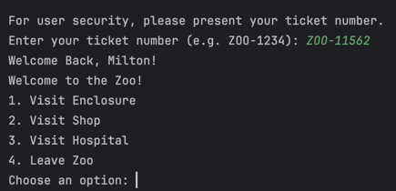

# Lab 1: UML Class Diagram to Java Program
## Group Members:
- Flores, Manalo, Pardines

## Demo Screenshots:
### Zoo Main (Try to Setup Handler Without Zoo Setup):

### Zoo Setup

### Zoo Handler

### Open Zoo

### Ticketing Module

#### Ticket Validation

### Visiting Enclosures

### Shops

#### Total on Check Out

### Hospital 

### Close and Leave Zoo
